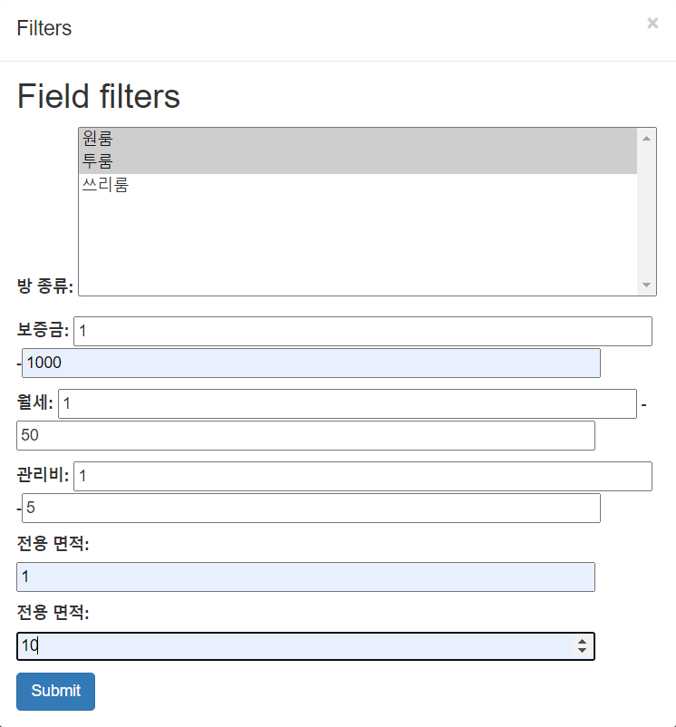

# Myhome

### Room
- URL: http://127.0.0.1:8000/api/rooms/
- Method: GET, POST
```python
[
    {
        "id": 1,
        "comments": [
            {
                "id": 1,
                "pros": "학교랑 가깝다.",
                "cons": "방음이 안된다.",
                "content": "집주인분 친절하시고 집도 큰 문제 없이 좋습니다.",
                "rate": 4.5,
                "user": 2,
                "room": 1
            }
        ],
        "photos": [
            {
                "id": 1,
                "photo_file": "http://127.0.0.1:8000/media/photo/2021/01/01/CAM00376.jpg",
                "room": 1
            }
        ],
        "address": "서울특별시 서대문구 연세로 50",
        "zip_code": "03722",
        "room_type": "원룸",
        "deposit": 1000,
        "monthly_rent": 50,
        "management_fee": 5,
        "total_floor": 3,
        "floor": 2,
        "structure": "일반",
        "space": 20,
        "completion_year": 2010,
        "elevator": true,
        "bed": true,
        "desk": true,
        "refrigerator": true,
        "induction": true,
        "air_conditioner": true,
        "washer": true,
        "short_term": false,
        "heating": "중앙난방",
        "occupancy_date": "2021-01-01",
        "introduction": "이만한 집이 없어요~",
        "detail": "안녕하세요 연세대학교 서문 근처에 위치한 하우스입니다~",
        "distance": "연세대학교 서문 5분 거리",
        "activation": true,
        "user": 3
    }
]
```

- URL: http://127.0.0.1:8000/api/rooms/1/
- Method: GET, PUT, DELETE
```python
{
    "id": 1,
    "comments": [
        {
            "id": 1,
            "pros": "학교랑 가깝다.",
            "cons": "방음이 안된다.",
            "content": "집주인분 친절하시고 집도 큰 문제 없이 좋습니다.",
            "rate": 4.5,
            "user": 2,
            "room": 1
        }
    ],
    "photos": [
        {
            "id": 1,
            "photo_file": "http://127.0.0.1:8000/media/photo/2021/01/01/CAM00376.jpg",
            "room": 1
        }
    ],
    "address": "서울특별시 서대문구 연세로 50",
    "zip_code": "03722",
    "room_type": "원룸",
    "deposit": 1000,
    "monthly_rent": 50,
    "management_fee": 5,
    "total_floor": 3,
    "floor": 2,
    "structure": "일반",
    "space": 20,
    "completion_year": 2010,
    "elevator": true,
    "bed": true,
    "desk": true,
    "refrigerator": true,
    "induction": true,
    "air_conditioner": true,
    "washer": true,
    "short_term": false,
    "heating": "중앙난방",
    "occupancy_date": "2021-01-01",
    "introduction": "이만한 집이 없어요~",
    "detail": "안녕하세요 연세대학교 서문 근처에 위치한 하우스입니다~",
    "distance": "연세대학교 서문 5분 거리",
    "activation": true,
    "user": 3
}
```

Filter
- URL: http://127.0.0.1:8000/api/rooms/?room_type=원룸&room_type=투룸&deposit_min=1&deposit_max=1000&monthly_rent_min=1&monthly_rent_max=50&management_fee_min=1&management_fee_max=5&space_min=1&space_max=10
- Method: GET   


Nested list
- URL: http://127.0.0.1:8000/api/rooms/1/comment-list/
- Method: GET
```python
[
    {
        "id": 1,
        "pros": "학교랑 가깝다.",
        "cons": "방음이 안된다.",
        "content": "집주인분 친절하시고 집도 큰 문제 없이 좋습니다.",
        "rate": 4.5,
        "user": 2,
        "room": 1
    }
]
```

- URL: http://127.0.0.1:8000/api/rooms/1/photo-list/
- Method: GET
```python
[
    {
        "id": 1,
        "photo_file": "/media/photo/2021/01/01/CAM00376.jpg",
        "room": 1
    }
]
```

### User
- URL: http://127.0.0.1:8000/api/users/
- Method: GET, POST
```python
[
    {
        "id": 1,
        "interest_rooms": [],
        "email": "kann1997@naver.com",
        "password": "pbkdf2_sha256$180000$kBeGpElEXFD4$TN3RQyjB5Mq0GJlrD2QSRGwPYYouNXPJaxTF+PpAsX8=",
        "name": "",
        "contact": "",
        "birth": null,
        "gender": "",
        "role": "멘티",
        "reviews": []
    },
    {
        "id": 2,
        "interest_rooms": [
            {
                "id": 1,
                "comments": [
                    {
                        "id": 1,
                        "pros": "학교랑 가깝다.",
                        "cons": "방음이 안된다.",
                        "content": "집주인분 친절하시고 집도 큰 문제 없이 좋습니다.",
                        "rate": 4.5,
                        "user": 2,
                        "room": 1
                    }
                ],
                "photos": [
                    {
                        "id": 1,
                        "photo_file": "http://127.0.0.1:8000/media/photo/2021/01/01/CAM00376.jpg",
                        "room": 1
                    }
                ],
                "address": "서울특별시 서대문구 연세로 50",
                "zip_code": "03722",
                "room_type": "원룸",
                "deposit": 1000,
                "monthly_rent": 50,
                "management_fee": 5,
                "total_floor": 3,
                "floor": 2,
                "structure": "일반",
                "space": 20,
                "completion_year": 2010,
                "elevator": true,
                "bed": true,
                "desk": true,
                "refrigerator": true,
                "induction": true,
                "air_conditioner": true,
                "washer": true,
                "short_term": false,
                "heating": "중앙난방",
                "occupancy_date": "2021-01-01",
                "introduction": "이만한 집이 없어요~",
                "detail": "안녕하세요 연세대학교 서문 근처에 위치한 하우스입니다~",
                "distance": "연세대학교 서문 5분 거리",
                "activation": true,
                "user": 3
            }
        ],
        "email": "asdf@naver.com",
        "password": "qwer1234",
        "name": "김호미",
        "contact": "01012341234",
        "birth": "2021-01-01",
        "gender": "여성",
        "role": "멘티",
        "reviews": []
    },
    {
        "id": 3,
        "interest_rooms": [],
        "email": "qwer@naver.com",
        "password": "qwer1234",
        "name": "집주인",
        "contact": "01023452345",
        "birth": "1970-10-22",
        "gender": "남성",
        "role": "멘티",
        "reviews": []
    },
    {
        "id": 4,
        "interest_rooms": [],
        "email": "zxcv@naver.com",
        "password": "qwer1234",
        "name": "멘토",
        "contact": "01034563456",
        "birth": "1983-11-11",
        "gender": "남성",
        "role": "멘토",
        "reviews": [
            {
                "id": 1,
                "content": "너무 친절하시고 상세히 알려주셔서 좋았습니다!",
                "rate": 5.0,
                "tenant": 2,
                "mentor": 4
            }
        ]
    }
]
```

### Review
- URL: http://127.0.0.1:8000/api/reviews/
- Method: GET, POST
```python
[
    {
        "id": 1,
        "content": "너무 친절하시고 상세히 알려주셔서 좋았습니다!",
        "rate": 5.0,
        "tenant": 2,
        "mentor": 4
    }
]
```

Nested list
- URL: http://127.0.0.1:8000/api/users/4/review-list/
- Method: GET
```python
[
    {
        "id": 1,
        "content": "너무 친절하시고 상세히 알려주셔서 좋았습니다!",
        "rate": 5.0,
        "tenant": 2,
        "mentor": 4
    }
]
```

### Comment
- URL: http://127.0.0.1:8000/api/comments/
- Method: GET, POST
```python
[
    {
        "id": 1,
        "pros": "학교랑 가깝다.",
        "cons": "방음이 안된다.",
        "content": "집주인분 친절하시고 집도 큰 문제 없이 좋습니다.",
        "rate": 4.5,
        "user": 2,
        "room": 1
    }
]
```

### Photo
- URL: http://127.0.0.1:8000/api/photos/
- Method: GET, POST
```python
[
    {
        "id": 1,
        "photo_file": "http://127.0.0.1:8000/media/photo/2021/01/01/CAM00376.jpg",
        "room": 1
    }
]
```
